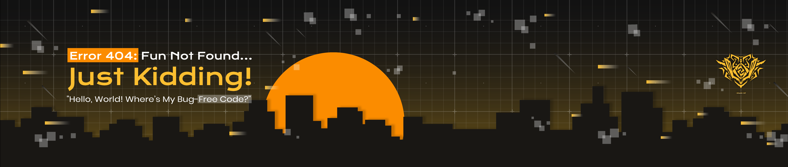

## 
🛜 Currently studying **Multimedia Engineering Technology** at **Telkom University** (2022 - present)  
👨🏼‍🎓 Undergraduate with a passion for **Game Development** <!--!and **App Development**-->  
🎨 Skilled in **UI/UX Design**, bringing designs to life as a **Graphic Designer**  
📱 Actively exploring new technologies and creating innovative solutions for digital experiences

<h3>My GitHub Contributions Summary</h3>

  
  
  <!---->
    
  

### 💻 Tech Stack, I Rely On

  
  
  
  
  
  
  
  
  
  
  
  
  
  
  <!-- New Badges for Adobe Photoshop, Adobe Illustrator, Figma, Wix Studio, Ibis Paint -->
  
  
  
  
  
  

## 🌐 Connect with Me 🍬
 
 
 

<picture>
  <source media="(prefers-color-scheme: dark)" srcset="https://raw.githubusercontent.com/myusiz3/myusiz3/output/github-snake-dark.svg" />
  <source media="(prefers-color-scheme: light)" srcset="https://raw.githubusercontent.com/myusiz3/myusiz3/output/github-snake.svg" />
  
</picture>
<!--### 📌 My Pinned Repositories
-->

