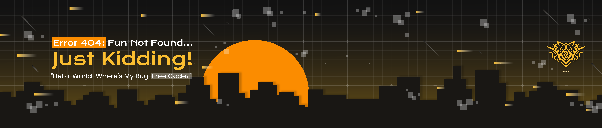

## 

Multimedia Engineering Technology graduate from **Telkom University** specializing in Creative Development, UI/UX Design, and Interactive Media.

- **Specialization**: UI/UX Design, Web Engineering, and Interactive Technologies (AR/VR & Game Dev).
- **Core Philosophy**: Merging creative aesthetics with structured engineering to build functional, interactive digital experiences.
- **Current Pursuit**: Crafting high-performance web applications, exploring real-time graphics, and fine-tuning user interaction design.

  
  

---

### GitHub Activity Overview

  

---

### Tech Stack & Tools

  
  
  
  
  
  
  
  
  
  
  
  
  
  
  
  

---

### Connect with Me

 

<picture>
  <source media="(prefers-color-scheme: dark)" srcset="https://raw.githubusercontent.com/myusiz3/myusiz3/output/github-snake-dark.svg" />
  <source media="(prefers-color-scheme: light)" srcset="https://raw.githubusercontent.com/myusiz3/myusiz3/output/github-snake.svg" />
  
</picture>
